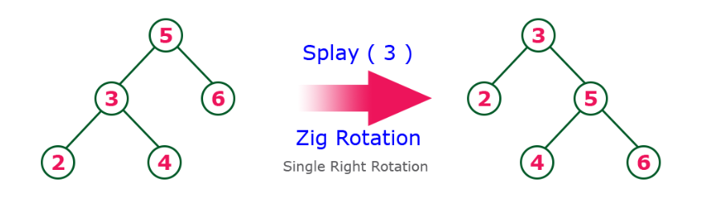
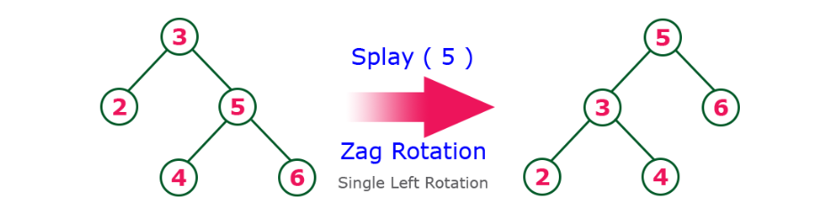
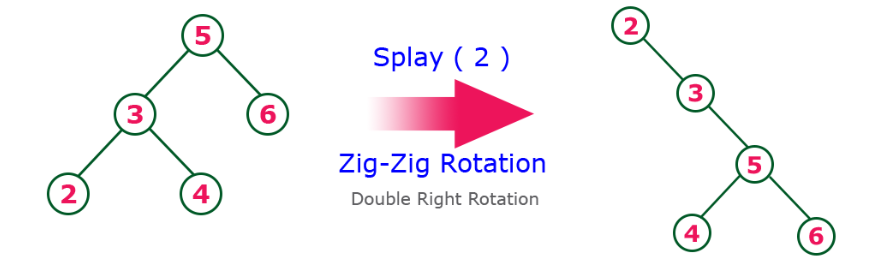
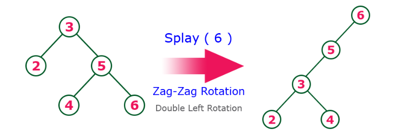
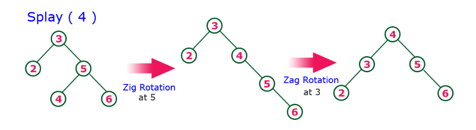
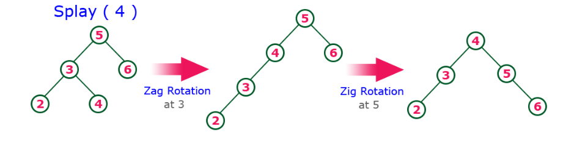

== Splay Trees(Splay Ağaçları)

Splay ağacı, ikili arama ağacının başka bir çeşididir. Bir splay ağacında, en son erişilen düğüm ağacın köküne yerleştirilir. Bir splay ağacı aşağıdaki gibi tanımlanır.

Splay Tree, düğüm üzerindeki her işlemin, düğümün ağacın kök konumuna yerleştirilmesi için ağacı yeniden düzenlendiği kendinden ayarlı bir İkili Arama Ağacıdır.

Bir splay ağacında, her işlem ağacın kökünde gerçekleştirilir. Splay ağacındaki tüm işlemler "Splaying" adı verilen ortak bir işlemle ilgilidir.

Splaying, düğümün uygun döndürme işlemleri yapılarak kök konumuna getirilmesi işlemidir.

Bir splay ağacında, bir düğümüne splaying işlemi uygulanması sonucu ağaçtaki tüm düğümleri yeniden düzenler, böylece splaying işlemi görmüş düğüm ağacın köküne yerleştirilir.

Splaying işlemi uygulayarak, daha sık kullanılan düğümleri ağacın köküne yaklaştırırız, böylece bu düğümler üzerindeki herhangi bir işlem hızlı bir şekilde gerçekleştirilir. Bu, yayma işleminin otomatik olarak daha sık kullanılan düğümleri ağacın köküne yaklaştırması anlamına gelir.

Splay ağacındaki her işlem, splaying işlemini gerçekleştirir. Örneğin, ekleme işlemi önce ikili arama ağacı ekleme işlemini kullanarak yeni düğümü ekler, ardından yeni eklenen düğüm ağacın köküne yerleştirilecek şekilde açılır. Bir splay ağacındaki arama işlemi, ikili arama işlemini kullanarak düğümü aramaktan ve sonra aranan öğeyi ağacın köküne yerleştirmek için göstermekten başka bir şey değildir.

Splay ağacında, herhangi bir düğümü görüntülemek için aşağıdaki döndürme işlemlerini kullanırız.

1. Zig Rotasyonu
2. Zag Rotasyonu
3. Zig - Zig Rotasyonu
4. Zag - Zag Rotasyonu
5. Zig - Zag Rotasyonu
6. Zag - Zig Rotasyonu

=== Zig Rotasyonu
Splay ağacındaki Zig Rotasyonu, AVL Ağacı rotasyonlarındaki tek sağa dönüşe benzer. Zig rotasyonunda, her düğüm mevcut konumundan bir konum sağa doğru hareket eder.

=== Zag Rotasyonu
Splay ağacındaki Zag Rotasyonu, AVL Ağacı rotasyonlarındaki tek sola dönüşe benzer. Zag rotasyonunda, her düğüm mevcut konumundan bir konum sola hareket eder.

=== Zig-Zig Rotasyonu
Splay ağacındaki Zig-Zig Rotasyonu, çift zig rotasyonudur. Zig-zig rotasyonunda, her düğüm mevcut konumundan sağa doğru iki konum hareket eder.

=== Zag-Zag Rotasyonu
Splay ağacındaki Zag-Zag Rotasyonu, çift zag rotasyonudur. Zag-zag rotasyonunda, her düğüm mevcut konumundan iki konum sola hareket eder.

=== Zig-Zag Rotasyonu
Splay ağacındaki Zig-Zag Rotasyonu, bir zig dönüşü rotasyonu ve bunu takip eden zag rotasyonudur. Zig-zag dönüşünde, her düğüm geçerli konumundan bir konum sağa, ardından bir konum sola hareket eder. 

=== Zag-Zig Rotasyonu
Splay ağacındaki Zag-Zig Rotasyonu, bir zag rotasyonu ve bunu takip eden zig dönüşü rotasyonudur. Zag-zig dönüşünde, her düğüm bir konum sola ve ardından geçerli konumundan bir konum sağa doğru hareket eder.

=== Splay Ağacına Ekleme İşlemi

Splay ağacındaki ekleme işlemi aşağıdaki adımlar kullanılarak gerçekleştirilir ...

* Adım 1 - Ağacın Boş olup olmadığını kontrol edin.
* Adım 2 - Ağaç Boşsa, yeni düğümü Kök düğüm olarak ekleyin ve işlemden çıkın.
* Adım 3 - Ağaç Boş değilse, İkili Arama ağaç ekleme mantığını kullanarak yeni Düğümü yaprak düğümü olarak ekleyin.
* Adım 4 - Ekledikten sonra düğüm üzerinde splaying işlemini yapın.

=== Splay Ağacına'dd Silme İşlemi

Splay ağacındaki silme işlemi İkili Arama Ağacındaki silme işlemine benzer. Ancak öğeyi silmeden önce, önce o düğüme splaying işlemi uygulamamız ve ardından onu kök konumundan silmemiz gerekir.